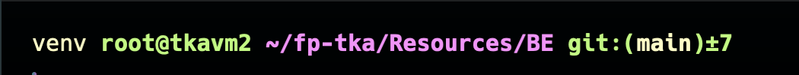

# Laporan Final Project Teknologi Komputasi Awan 2024

## Anggota Kelompok

| Nama Lengkap          | NRP        |
| --------------------- | ---------- |
| Maulana Ahmad Zahiri  | 5027231010 |
| Athalla Barka Fadhil  | 5027231018 |
| Muhammad Dzaky Ahnaf  | 5027231039 |
| Randist Prawandha P.  | 5027231059 |
| Azza Farichi Tjahjono | 5027231071 |

## I. Introduction

Anda adalah seorang lulusan Teknologi Informasi, sebagai ahli IT, salah satu kemampuan yang harus dimiliki adalah **Keampuan merancang, membangun, mengelola aplikasi berbasis komputer menggunakan layanan awan untuk memenuhi kebutuhan organisasi.**

Pada suatu saat anda mendapatkan project untuk mendeploy sebuah aplikasi Sentiment Analysis dengan komponen Backend menggunakan python: [sentiment-analysis.py](/Resources/BE/sentiment-analysis.py) dengan spesifikasi sebagai berikut

### Endpoints:

1. **Analyze Text**

   - **Endpoint:** `POST /analyze`
   - **Description:** This endpoint accepts a text input and returns the sentiment score of the text.
   - **Request:**
     ```json
     {
       "text": "Your text here"
     }
     ```
   - **Response:**
     ```json
     {
       "sentiment": <sentiment_score>
     }
     ```

2. **Retrieve History**
   - **Endpoint:** `GET /history`
   - **Description:** This endpoint retrieves the history of previously analyzed texts along with their sentiment scores.
   - **Response:**
     ```json
     {
      {
        "text": "Your previous text here",
        "sentiment": <sentiment_score>
      },
      ...
     }
     ```

---

Kemudian juga disediakan sebuah Frontend sederhana menggunakan [index.html](/Resources/FE/index.html) dan [styles.css](/Resources/FE/styles.css) dengan tampilan antarmuka sebagai berikut



Kemudian anda diminta untuk mendesain arsitektur cloud yang sesuai dengan kebutuhan aplikasi tersebut. Apabila dana maksimal yang diberikan adalah **1 juta rupiah per bulan (65 US$)**
konfigurasi cloud terbaik seperti apa yang bisa dibuat?

## II. Desain Rancangan Arsitektur Komputasi Awan dan Tabel Harga Spesifikasi VM

Pada project kali ini, kami menggunakan satu provider yaitu DigitalOcean, pada DigitalOcean kami menggunakan 3 droplet.

**Rancangan:**


dengan rincian harga sebagai berikut.

**Rincian Harga:**

<table>
  <tr>
    <th>No.</th>
    <th>Nama</th>
    <th>Spesifikasi</th>
    <th>Fungsi</th>
    <th>Harga per Bulan</th>
  </tr>
  <tr>
    <td>1</td>
    <td>tkavm1</td>
    <td>10GB storage, 1GB RAM</td>
    <td>App Worker 1</td>
    <td>$16</td>
  </tr>
  <tr>
    <td>2</td>
    <td>tkavm2</td>
    <td>100GB storage, 8GB RAM</td>
    <td>App WOrker 2</td>
    <td>$16</td>
  </tr>
  <tr>
    <td>3</td>
    <td>tkavm3</td>
    <td>.com, 1-year renewal</td>
    <td>Load Balancer</td>
    <td>$15</td>
  </tr>
  <tr>
    <td>4</td>
    <td>tkadatabase</td>
    <td>Unlimited data, 5 devices</td>
    <td>MongoDB</td>
    <td>$15</td>
  </tr>
  <tr>
    <td colspan="4" style="text-align:right;"><strong>Total</strong></td>
    <td><strong>$62</strong></td>
  </tr>
</table>


## III. Langkah-langkah Implementasi dan Konfigurasi
### A. Setup VM 1
1. pertama `ssh` kedalam VM1 dan masukkan password VM
   
   

2. Jalankan beberapa command berikut dan git clone [repo](https://github.com/fuaddary/fp-tka) kedalam VM1
   ```
   sudo apt update
   sudo apt upgrade

   # git clone repo
   git clone https://github.com/fuaddary/fp-tka
   ```

3. 


## IV. Hasil Pengujian Endpoint Setiap API dan UI Aplikasi
## V. Hasil Pengujian dan Analisis Loadtesting Locust
## VI. Kesimpulan dan Saran
