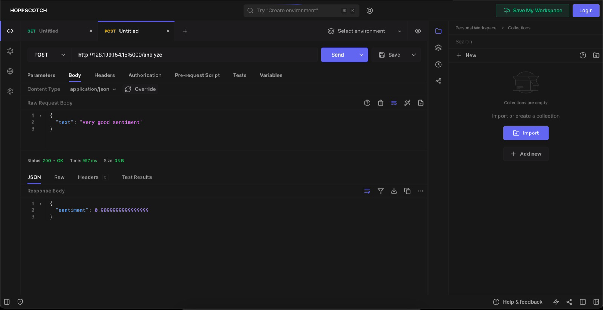
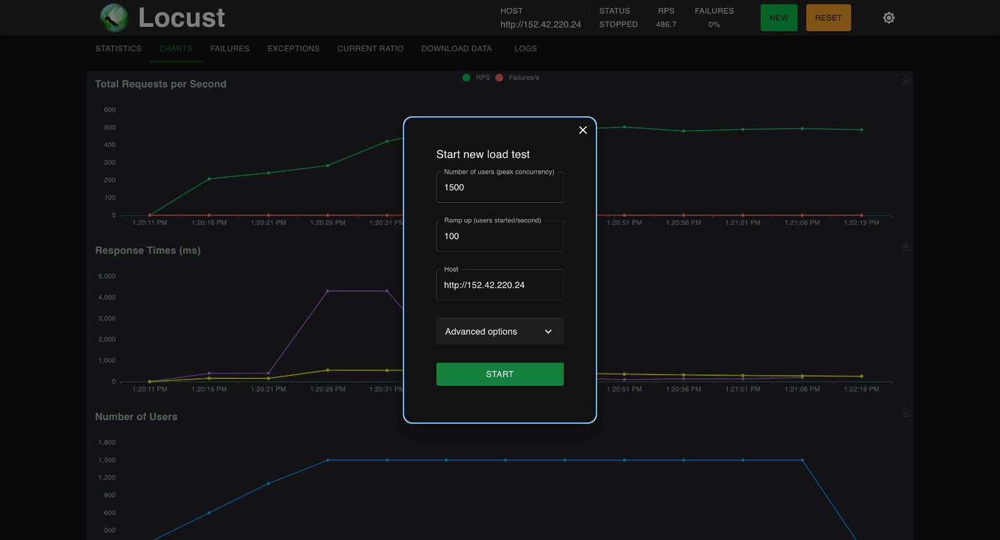
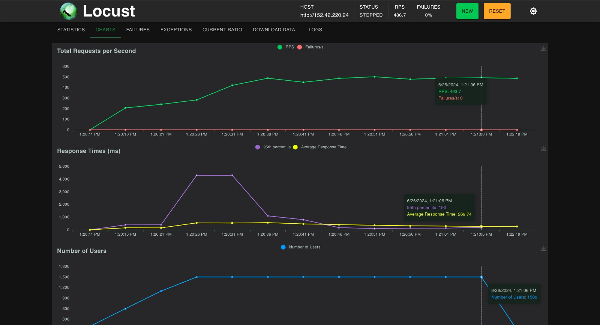
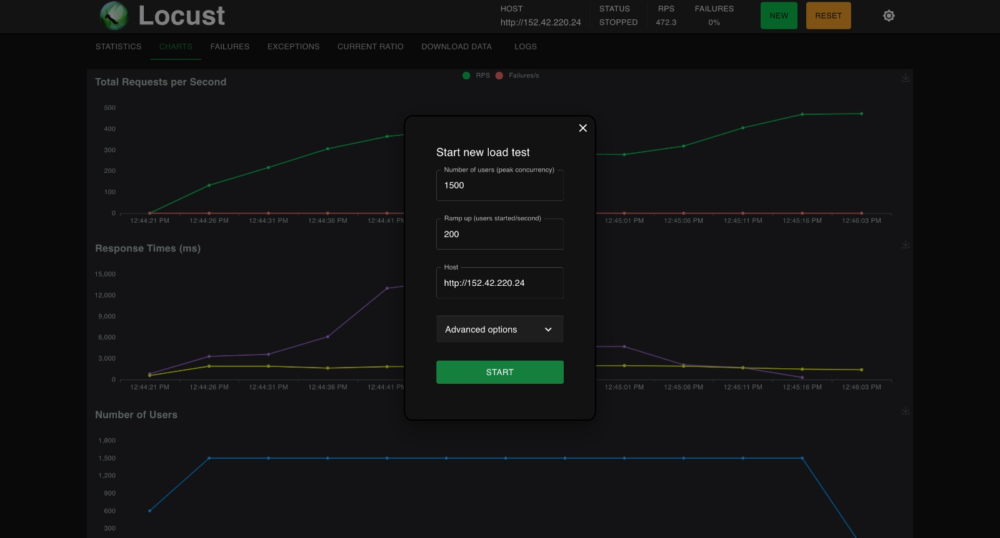
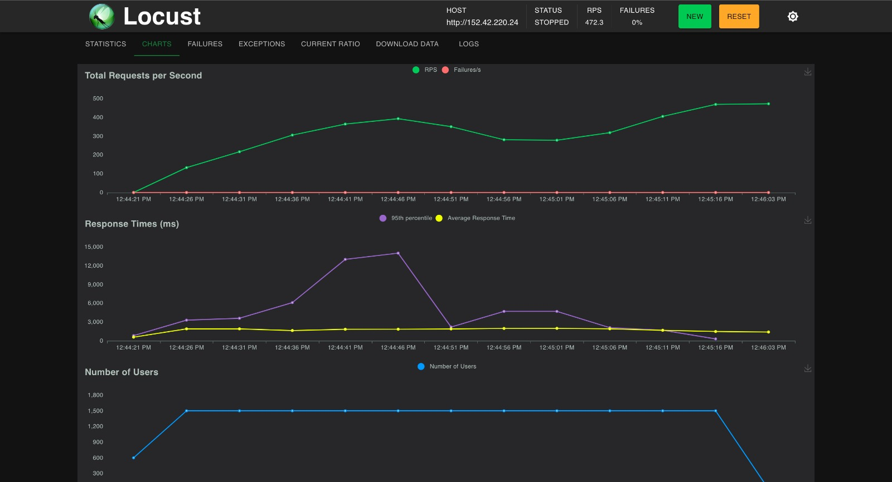
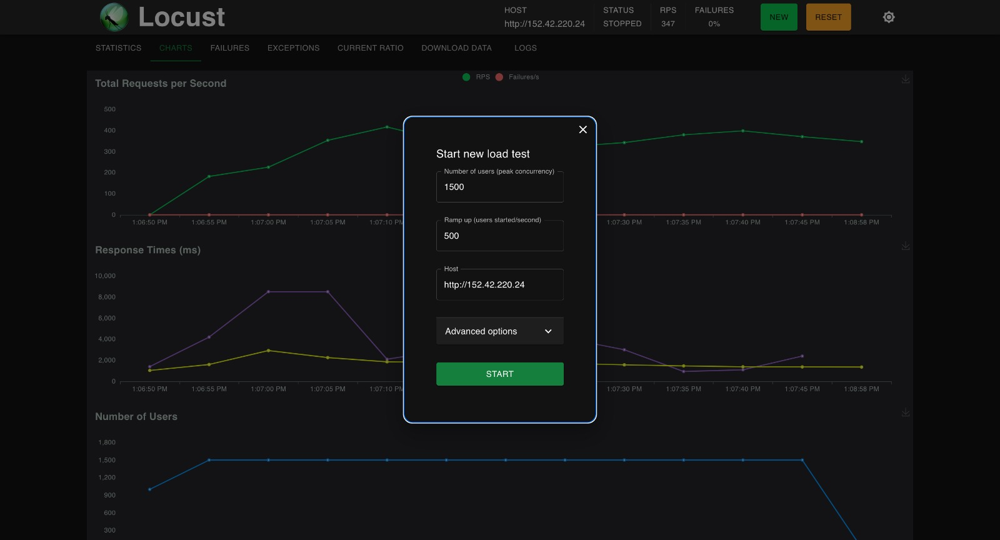
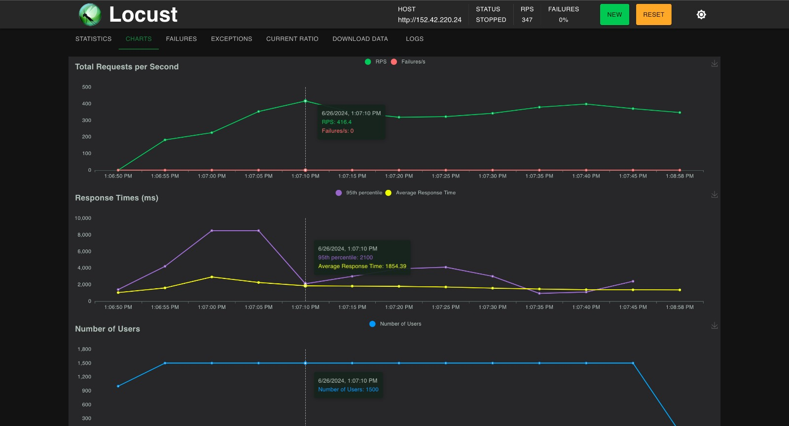

# Laporan Final Project Teknologi Komputasi Awan 2024

## Anggota Kelompok

| Nama Lengkap          | NRP        |
| --------------------- | ---------- |
| Maulana Ahmad Zahiri  | 5027231010 |
| Athalla Barka Fadhil  | 5027231018 |
| Muhammad Dzaky Ahnaf  | 5027231039 |
| Randist Prawandha P.  | 5027231059 |
| Azza Farichi Tjahjono | 5027231071 |

## I. Introduction

Anda adalah seorang lulusan Teknologi Informasi, sebagai ahli IT, salah satu kemampuan yang harus dimiliki adalah **Keampuan merancang, membangun, mengelola aplikasi berbasis komputer menggunakan layanan awan untuk memenuhi kebutuhan organisasi.**

Pada suatu saat anda mendapatkan project untuk mendeploy sebuah aplikasi Sentiment Analysis dengan komponen Backend menggunakan python: [sentiment-analysis.py](/Resources/BE/sentiment-analysis.py) dengan spesifikasi sebagai berikut

### Endpoints:

1. **Analyze Text**

   - **Endpoint:** `POST /analyze`
   - **Description:** This endpoint accepts a text input and returns the sentiment score of the text.
   - **Request:**
     ```json
     {
       "text": "Your text here"
     }
     ```
   - **Response:**
     ```json
     {
       "sentiment": <sentiment_score>
     }
     ```

2. **Retrieve History**
   - **Endpoint:** `GET /history`
   - **Description:** This endpoint retrieves the history of previously analyzed texts along with their sentiment scores.
   - **Response:**
     ```json
     {
      {
        "text": "Your previous text here",
        "sentiment": <sentiment_score>
      },
      ...
     }
     ```

---

Kemudian juga disediakan sebuah Frontend sederhana menggunakan [index.html](/Resources/FE/index.html) dan [styles.css](/Resources/FE/styles.css) dengan tampilan antarmuka sebagai berikut


Kemudian anda diminta untuk mendesain arsitektur cloud yang sesuai dengan kebutuhan aplikasi tersebut. Apabila dana maksimal yang diberikan adalah **1 juta rupiah per bulan (65 US$)**
konfigurasi cloud terbaik seperti apa yang bisa dibuat?

## II. Desain Rancangan Arsitektur Komputasi Awan dan Tabel Harga Spesifikasi VM

Pada project kali ini, kami menggunakan satu provider yaitu DigitalOcean, pada DigitalOcean kami menggunakan 3 droplet.

**Rancangan:**


dengan rincian harga sebagai berikut.

**Rincian Harga:**

<table>
  <tr>
    <th>No.</th>
    <th>Nama</th>
    <th>Spesifikasi</th>
    <th>Fungsi</th>
    <th>Harga per Bulan</th>
  </tr>
  <tr>
    <td>1</td>
    <td>tkavm1</td>
    <td>35GB storage, 2GB RAM, 2 Intel vCPUs</td>
    <td>App Worker 1 and DB1</td>
    <td>$21</td>
  </tr>
  <tr>
    <td>2</td>
    <td>tkavm2</td>
    <td>35GB storage, 2GB RAM, 2 Intel vCPUs</td>
    <td>App Worker 2 and DB2</td>
    <td>$21</td>
  </tr>
  <tr>
    <td>3</td>
    <td>tkavm3</td>
    <td>35GB storage, 2GB RAM, 2 Intel vCPUs</td>
    <td>Load Balancer</td>
    <td>$21</td>
  </tr>
  <tr>
    <td colspan="4" style="text-align:right;"><strong>Total</strong></td>
    <td><strong>$63</strong></td>
  </tr>
</table>

## III. Langkah-langkah Implementasi dan Konfigurasi

### A. Setup VM 1 dan 2

Setup VM1 dan VM2:

- ssh root@ip-vmx
- git clone https://github.com/fuaddary/fp-tka.git
- cd fp-tka/Resources/BE
- sudo apt install python3-venv
- python -m venv venv
- source venv/bin/activate
- edit mongodb URL
- pip install flask flask-cors textblob pymongo
- python sentiment-analysis.py

### A. Setup VM 3 (Load Balancer)

- sudo apt update
- sudo apt install nginx
- git clone https://github.com/fuaddary/fp-tka.git
- sudo vim /etc/nginx/sites-available/app (MASUKKAN CONFIG NGINX)
- sudo systemctl restart nginx

### Setup FE:

- SSH ke VM1 dan VM2
- cd fp-tka/Resources/FE
- cp index.html /var/www/html && cp styles.css var/www/html
- edit index.html untuk menggunakan URL BE
- sudo vim /etc/nginx/sites-available/app (MASUKKAN CONFIG NGINX)
- sudo unlink /etc/nginx/sites-available/default
- sudo ln -s /etc/nginx/sites-available/app /etc/nginx/sites-enabled
- sudo systemctl restart nginx

## IV. Hasil Pengujian Endpoint Setiap API dan UI Aplikasi

### Uji Endpoint /history


### Uji Endpoint /analyze



## V. Hasil Pengujian dan Analisis Loadtesting Locust

### Uji RPS selama 60s

NOTES: TES DILAKUKAN SELAMA 60S

### Uji Peak Concurrency Dengan Spawn Rate 50/s

RPS = 568.6
SCORE = 568.6/200\*30 = 85.29


### Uji Peak Concurrency Dengan Spawn Rate 100/s

RPS = 486.7
SCORE = 486.7/200\*30 = 73



### Uji Peak Concurrency Dengan Spawn Rate 200/s

RPS = 472.3
SCORE = 472.3/200\*30 = 70.84



### Uji Peak Concurrency Dengan Spawn Rate 500/s

RPS = 347
SCORE = 347/200\*30 = 52.05



## VI. Kesimpulan dan Saran
