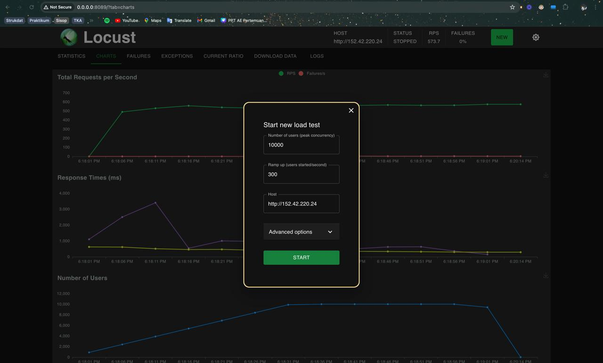
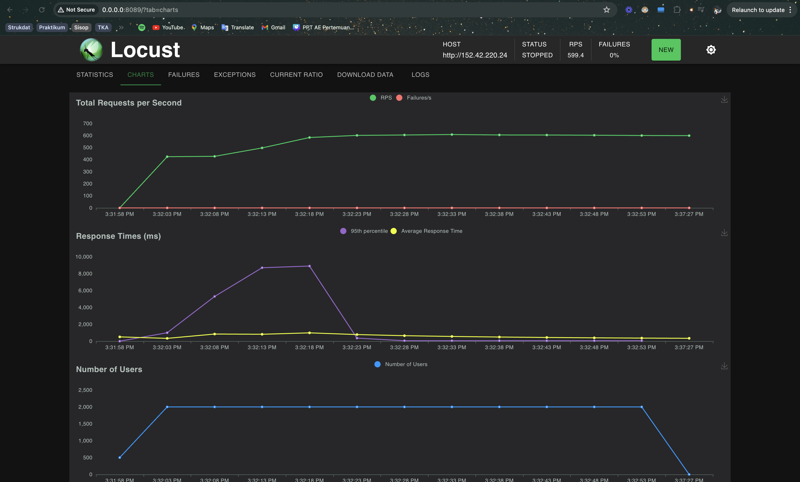

# Laporan Final Project Teknologi Komputasi Awan 2024

## Anggota Kelompok

| Nama Lengkap          | NRP        |
| --------------------- | ---------- |
| Maulana Ahmad Zahiri  | 5027231010 |
| Athalla Barka Fadhil  | 5027231018 |
| Muhammad Dzaky Ahnaf  | 5027231039 |
| Randist Prawandha P.  | 5027231059 |
| Azza Farichi Tjahjono | 5027231071 |

## I. Introduction

Anda adalah seorang lulusan Teknologi Informasi, sebagai ahli IT, salah satu kemampuan yang harus dimiliki adalah **Keampuan merancang, membangun, mengelola aplikasi berbasis komputer menggunakan layanan awan untuk memenuhi kebutuhan organisasi.**

Pada suatu saat anda mendapatkan project untuk mendeploy sebuah aplikasi Sentiment Analysis dengan komponen Backend menggunakan python: [sentiment-analysis.py](/Resources/BE/sentiment-analysis.py) dengan spesifikasi sebagai berikut

### Endpoints:

1. **Analyze Text**

   - **Endpoint:** `POST /analyze`
   - **Description:** This endpoint accepts a text input and returns the sentiment score of the text.
   - **Request:**
     ```json
     {
       "text": "Your text here"
     }
     ```
   - **Response:**
     ```json
     {
       "sentiment": <sentiment_score>
     }
     ```

2. **Retrieve History**
   - **Endpoint:** `GET /history`
   - **Description:** This endpoint retrieves the history of previously analyzed texts along with their sentiment scores.
   - **Response:**
     ```json
     {
      {
        "text": "Your previous text here",
        "sentiment": <sentiment_score>
      },
      ...
     }
     ```

---

Kemudian juga disediakan sebuah Frontend sederhana menggunakan [index.html](/Resources/FE/index.html) dan [styles.css](/Resources/FE/styles.css) dengan tampilan antarmuka sebagai berikut


Dapat dilihat bahwa FE telah bekerja dengan baik dan berhasil connect ke BE

Kemudian anda diminta untuk mendesain arsitektur cloud yang sesuai dengan kebutuhan aplikasi tersebut. Apabila dana maksimal yang diberikan adalah **1 juta rupiah per bulan (65 US$)**
konfigurasi cloud terbaik seperti apa yang bisa dibuat?

## II. Desain Rancangan Arsitektur Komputasi Awan dan Tabel Harga Spesifikasi VM

Pada project kali ini, kami menggunakan satu provider yaitu DigitalOcean, pada DigitalOcean kami menggunakan 3 Droplets.

**Rancangan:**


dengan rincian harga sebagai berikut.

**Rincian Harga:**

<table>
  <tr>
    <th>No.</th>
    <th>Nama</th>
    <th>Spesifikasi</th>
    <th>Fungsi</th>
    <th>Harga per Bulan</th>
  </tr>
  <tr>
    <td>1</td>
    <td>tkavm1</td>
    <td>35GB storage, 2GB RAM, 2 Intel vCPUs</td>
    <td>App Worker 1 and DB1</td>
    <td>$21</td>
  </tr>
  <tr>
    <td>2</td>
    <td>tkavm2</td>
    <td>35GB storage, 2GB RAM, 2 Intel vCPUs</td>
    <td>App Worker 2 and DB2</td>
    <td>$21</td>
  </tr>
  <tr>
    <td>3</td>
    <td>tkavm3</td>
    <td>35GB storage, 2GB RAM, 2 Intel vCPUs</td>
    <td>Load Balancer</td>
    <td>$21</td>
  </tr>
  <tr>
    <td colspan="4" style="text-align:right;"><strong>Total</strong></td>
    <td><strong>$63</strong></td>
  </tr>
</table>

## III. Langkah-langkah Implementasi dan Konfigurasi

### A. Setup VM 1 dan 2

Notes: Semua command dilakukan pada terminal, jika anda belum mengerti tentang terminal maka bisa lihat:

Tutorial: https://www.freecodecamp.org/news/command-line-for-beginners/

#### PREPARATIONS:

- sudo fallocate -l 10G /swapfile
- sudo chmod 600 /swapfile
- sudo mkswap /swapfile
- sudo swapon /swapfile
- sudo swapon --show
  

---

Penjelasan:
Karena kita menggunakan database didalam VM worker maka dianjurkan untuk mengalokasikan SWAP agar memory bisa dekelola dengan efisien dan memberikan ruang tambahan agar RAM tidak penuh

#### SETUP BACKEND:

- ssh root@ip-vmx
- git clone https://github.com/fuaddary/fp-tka.git
- cd fp-tka/Resources/BE
- sudo apt install python3-venv
- python -m venv venv
- source venv/bin/activate
   Pastikan sudah masuk kedalam `venv`
- pip install flask flask-cors textblob pymongo gunicorn gevent
- mv sentiment-analysis.py sentiment_analysis.py

---

Penjelasan:
Karena program kita adalah program python disini kita perlu untuk melakukan setup python environment untuk menjalankan program kita, lalu kita rename `sentiment-analysis.py` menjadi `sentiment_analysis.py` karena python tidak support penggunaan `-` dalam modul

##### MONGODB INSTALLATION

- ```bash
  sudo apt-get install gnupg curl
  ```

- ```bash
  curl -fsSL https://www.mongodb.org/static/pgp/server-7.0.asc | \
  sudo gpg -o /usr/share/keyrings/mongodb-server-7.0.gpg \
  --dearmor
  ```
- ```bash
  echo "deb [ arch=amd64,arm64 signed-by=/usr/share/keyrings/mongodb-server-7.0.gpg ] https://repo.mongodb.org/apt/ubuntu jammy/mongodb-org/7.0 multiverse" | sudo tee /etc/apt/sources.list.d/mongodb-org-7.0.list
  ```
- ```bash
  sudo apt-get update
  ```
- ```bash
  sudo apt-get install -y mongodb-org
  ```
- ```bash
  sudo systemctl start mongod
  ```

  reference: https://www.mongodb.com/docs/manual/tutorial/install-mongodb-on-ubuntu/

##### RUN PROGRAM

```bash
gunicorn -b 0.0.0.0:5000 -w 15 -k gevent --timeout --graceful-timeout 60 sentiment_analysis:app
```


Keterangan:

1. `-b 0.0.0.0:5000`: Menentukan Gunicorn untuk bind ke semua antarmuka jaringan pada port 5000.
2. `-w 15`: Menentukan Gunicorn untuk menjalankan 15 worker processes untuk menangani permintaan HTTP.

3. `-k gevent`: Menggunakan worker class `gevent`, yang memungkinkan Gunicorn untuk menjalankan aplikasi secara asynchronous menggunakan library gevent.

4. `--timeout 60`: Menentukan waktu maksimum (timeout) dalam detik untuk setiap request HTTP.

5. `--graceful-timeout 60`: Waktu maksimum (graceful timeout) dalam detik yang diberikan kepada worker untuk menyelesaikan permintaan yang sedang diproses sebelum Gunicorn menghentikan proses mereka secara graceful.

#### Setup FE:

- ssh root@ip-vmx
- cd fp-tka/Resources/FE
- cp index.html /var/www/html && cp styles.css var/www/html
- sudo nano /etc/nginx/sites-available/app (MASUKKAN CONFIG NGINX disini
  https://github.com/DzakyAhnaf/FP-TKA-2024/tree/main/nginx/FE/app)
- sudo unlink /etc/nginx/sites-available/default
- sudo ln -s /etc/nginx/sites-available/app /etc/nginx/sites-enabled
- sudo systemctl restart nginx
  akses pada browser dengan IP VM

### B. Setup VM 3 (Load Balancer)

- sudo apt update
- sudo apt install nginx
- git clone https://github.com/fuaddary/fp-tka.git
- sudo nano /etc/nginx/sites-available/app

  (MASUKKAN CONFIG https://github.com/DzakyAhnaf/FP-TKA-2024/tree/main/nginx/Load-Balancer/app)

- sudo unlink /etc/nginx/sites-enabled/default
- sudo ln -s /etc/nginx/sites-available/app /etc/nginx/sites-enabled
- sudo rm nginx.conf
- sudo nano nginx.conf

  (MASUKKAN CONFIG https://github.com/DzakyAhnaf/FP-TKA-2024/tree/main/nginx/Load-Balancer/nginx.conf)

- ulimit -n 100000
- sudo systemctl restart nginx

---

Penjelasan:
Kita menggunakan nginx sebagai web-server karena cepat dan mudah untuk disetup, nginx disini kita gunakan sebagai load balancer yang akan mendistribute requests ke VM worker. `ulimit -n 100000` dilakukan untuk menaikkan limit file descriptor yand dapat dibuka oleh linux.

### C. Setup Locust

Setup locust dilakukan secara lokal (diluar VM). Pastikan Python sudah terinstall, jika belum maka lihat:

- Windows: https://phoenixnap.com/kb/how-to-install-python-3-windows
- MacOS: https://www.freecodecamp.org/news/python-version-on-mac-update/
- All: https://kinsta.com/knowledgebase/install-python/

---

- git clone https://github.com/fuaddary/fp-tka.git
- cd /fp-tka/Resources/Test
- python -m venv venv
- source venv/bin/activate
  
- pip install locust
- locust

  Kemudian akses locust pada localhost:8089
  

## IV. Hasil Pengujian Endpoint Setiap API dan UI Aplikasi

Semua endpoint dapat diakses dengan baik.
Pengujian pada VM berhasil dilakukan, dapat dilihat dari status response status:`200` yang berarti sukses dan artinya database kita berjalan dengan baik karena kita program kita mereturn data dan post data dari database

### Tampilan FE


Dapat dilihat bahwa FE telah bekerja dengan baik dan berhasil connect ke BE

### Uji Endpoint /history

TKAVM1

Berhasil melakukan GET /history pada TKAVM1

TKAVM2

Berhasil melakukan GET /history pada TKAVM2

### Uji Endpoint /analyze

TKAVM1

Berhasil melakukan POST /analyze pada TKAVM1

TKAVM2

Berhasil melakukan POST /analyze pada TKAVM2

## V. Hasil Pengujian dan Analisis Loadtesting Locust

### Uji RPS selama 60s

NOTES: TES DILAKUKAN SELAMA 60S pada internet berkecepatan 50Mbps

### Uji Peak Concurrency Dengan Spawn Rate 50/s

RPS = 568.6
SCORE = 568.6/200\*30 = 85.29


Pada 2600 users mencapai peak RPS 617.7

### Uji Peak Concurrency Dengan Spawn Rate 100/s

RPS = 614.2
SCORE = 614.2/200\*30 = 92.13


Pada 2600 users mencapai peak RPS 614.2

### Uji Peak Concurrency Dengan Spawn Rate 200/s

RPS = 555.4
SCORE = 555.4/200\*30 = 83.31


Pada 5000 users mencapai peak RPS 572.3

### Uji Pak Concurrency Dengan Spawn Rate 300/s

RPS = 573.7
SCORE = 573.7/200\*30 = 86


Peak users sekitar 9900

### Uji Peak Concurrency Dengan Spawn Rate 500/s

RPS = 599.4
SCORE = 599.4/200\*30 = 89.91


Pada users 2000 mencapai peak RPS sekitar 599.4

## Resource Utilization

Dapat dilihat bahwa program memakan banyak CPU, database mongodb kita juga memakan banyak memori, itulah mengapa tadi kita memerlukan sebuah swap file

TKAVM1


TKAVM2


TKAVM3

Ketika program ditest menggunakan locust, load balancer bekerja dengan baik, bisa dilihat dari penggunaan CPU dan adanya banyak proses nginx seperti `nginx: worker process`, disini kita juga melakukan setup swap file sebanyak 2gb

## VI. Kesimpulan dan Saran

Berdasarkan uji coba yang telah dilakukan, didapatkan beberapa hasil yaitu:

1. **Kinerja dan Skalabilitas:**

   - Sistem berhasil menangani hingga 9900 (573 RPS)kemudian sistem juga berhasil mencapai dengan peak RPS (Requests Per Second) sekitar 617.7.
   - Penggunaan load balancer dengan Nginx efektif dalam mendistribusikan beban ke dua VM worker, menjaga stabilitas dan performa aplikasi.

2. **Efisiensi Biaya:**

   - Total biaya per bulan adalah $63, yang berada di bawah anggaran maksimal $65.
   - Penggunaan VM dengan spesifikasi 2GB RAM dan 2 vCPUs cukup untuk menangani beban kerja aplikasi, dengan penambahan swap file untuk efisiensi memori.

3. **Penggunaan Sumber Daya:**

   - Backend dan database MongoDB pada VM worker menunjukkan penggunaan CPU dan memori yang tinggi, namun tetap dalam batas yang dapat diterima.
   - Load balancer bekerja dengan baik, mendistribusikan trafik secara efisien tanpa menjadi bottleneck.

4. **Implementasi dan Konfigurasi:**

   - Proses setup dan konfigurasi VM dilakukan dengan baik, termasuk instalasi dan konfigurasi backend, frontend, dan database.
   - Penggunaan swap file membantu dalam mengelola penggunaan memori, mencegah overload pada RAM.

5. **Keandalan dan Uji Coba:**
   - Kecepatan Internet sangat berpengaruh sehingga ada waktu dimana RPS saat diuji testing mendapatkan hasil sangat jauh dibawah
   - Semua endpoint API dapat diakses dan berfungsi dengan baik, menunjukkan integrasi yang sukses antara backend dan database.
   - Pengujian dengan Locust menunjukkan bahwa sistem dapat menangani beban tinggi dengan performa yang baik.

### Saran:

1. **Optimasi Load Balancer:**

   - Gunakan multi thread pool dan cache pada konfigurasi nginx
   - Naikkan `worker_connections` pada nginx
   - Naikkan nginx timeout untuk menghindari adanya `ErrorConnectTimeout`

2. **Optimasi Aplikasi:**

   - Lakukan optimasi kode pada backend dan database untuk mengurangi penggunaan CPU dan memori.
   - Menggunakan worker class `gevent` saat menggunakan gunicorn dan sesuaikan worker dengan jumlah CPU

3. **Gunakan Internet Cepat**

   - Kecepatan Internet SANGAT berpengaruh dalam RPS, ketika kami melakukan uji coba dengan Internet lambat, RPS sangat jauh dibawah

4. **Penginkatan Infrastruktur**
   - Pertimbangkan untuk menambah jumlah worker atau meningkatkan spesifikasi VM jika diharapkan peningkatan beban yang lebih tinggi di masa mendatang.
   - Monitoring dan penyesuaian konfigurasi load balancer secara berkala untuk memastikan performa optimal.

### Live demo

[REVISI FP TKA C1](https://youtu.be/gVDjNbVtLLg)
